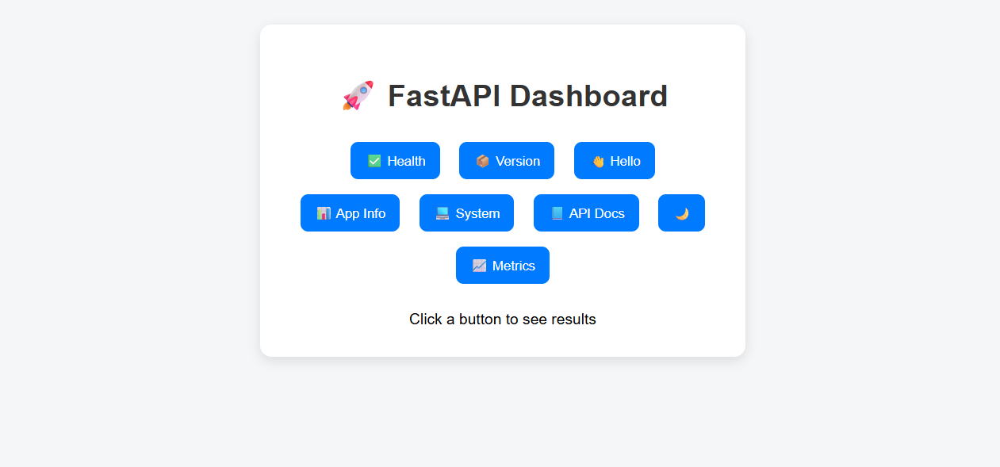

# 🚀 FastAPI Dockerized Monitoring Dashboard

## 📌 Overview
This project demonstrates how to build and containerize a FastAPI web application using Docker with best practices. It includes system monitoring features, health checks, and a simple interactive UI dashboard.

---

## ⚡ Features

✅ FastAPI backend  
✅ REST APIs  
✅ Docker containerization  
✅ Non-root user security  
✅ Docker HEALTHCHECK  
✅ Interactive UI Dashboard  
✅ Dark/Light theme toggle 🌙  
✅ System metrics (CPU, Memory, Uptime) 📊  
✅ Auto-detected environment info  
✅ API documentation (Swagger UI)  

---

## 🌐 API Endpoints

| Endpoint | Description |
|----------|------------|
| `/health` | Application health status |
| `/version` | App version |
| `/hello` | Sample response |
| `/info` | App libraries info |
| `/system` | System details |
| `/metrics` | CPU, Memory, Uptime |

---

## 🖥️ UI Dashboard

Access in browser: http://localhost:5000

### Features:
- Buttons to call APIs
- Live system metrics
- CPU usage progress bar
- Theme toggle (🌙 / ☀️)
- API Docs integration

---

## 🐳 Docker Setup

### Build Image

